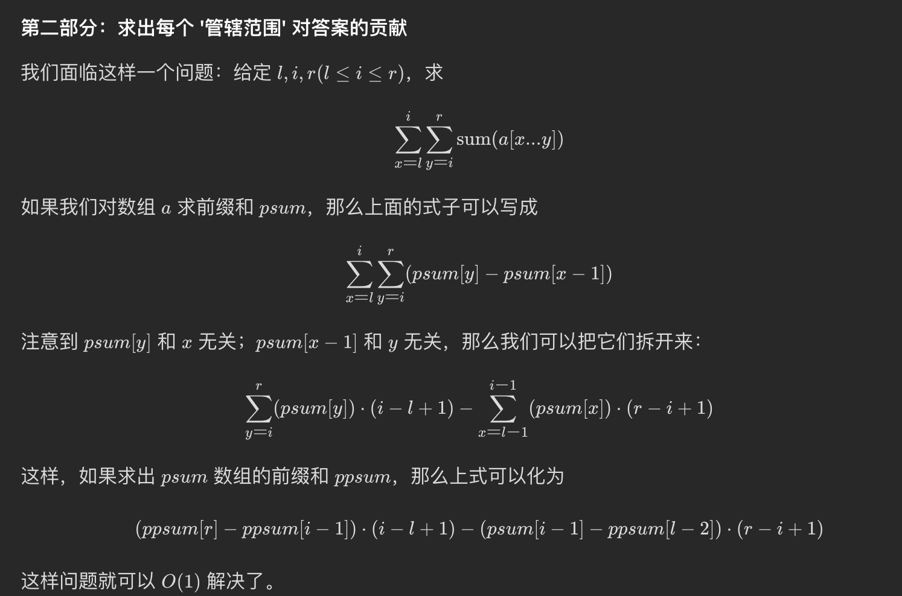
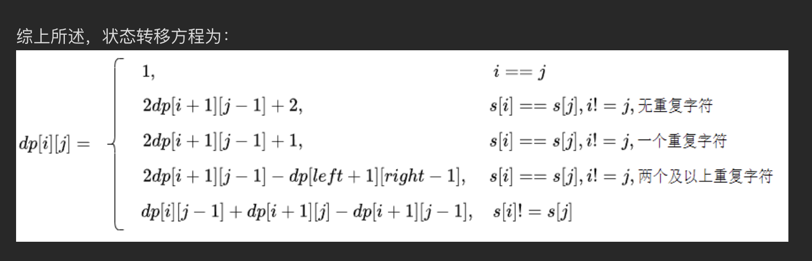

### 枚举+二分
lc6040. 花园的最大总美丽值

- 主要是在求partial的最小超时, 还有就是一个long long数据类型注意！！
-法一: 从右到左，先枚举完善花园数目，再计算不完善花园数据可以获得的最大
解决方案：使用二分+前缀和来求增加后的最小值，而不是一个一个遍历(空间复杂度O(n))

-法二: 如果是从左到右计算，可以将空间开销降到O(1)，先计算要让所有的花园变为完善花园还剩下的花的数量（可能为负数），然后遍历的时候一个一个加回去，同时不完善花园数目最小值是逐渐增大，所以可以在之前的结果上累加，不用重头计算

- 同样类型的题目，+k使最小的数能够达到的最大值，lc6039. K 次增加后的最大乘积（这道题也可以最小堆+1，一个一个加）


lc 6066. 统计区间中的整数数目
- 区间问题，主要是插入多个区间，如何合并得到最后的不重复的区间
- 使用hash start_end，那么每次判断的时候需要和前面一个和后面多个区间进行判断 upper_bound, 前面一个区间就是iter--
- 如果使用hash end_start(或者set<pair<end, start>>)那么只需要判断后面的多个可能覆盖的区间   lower_bound， iter++
- 每次合并区间，一定记得同时更新l_bound和r_bound
- 删除hash中的一个元素，并移动到下一个的正确姿势， hash.erase(iter++);
- 加速小技巧：为了不每次count都从头计算一次，可以使用插入的时候维护一个全局ans, 之后count的时候直接返回全局ans就可以了；这种利用先计算打表，后面直接使用的思想在前缀和，hulu面试的（组成平行四边形的个数）也可以体现出来
在进行i j两两组合的时候可以将，每组的组合方式求加和提前算出来，之后直接使用前缀和思想减掉0 到 i-1，就是当前i对应的组合方式


lc6077. 巫师的总力量和
- 子数组+区间问题
- 找到每个最小数的管辖区间（使用单调栈，同时为了避免出现数可能相等的情况使用了左边>=, 右边>的情况）
- 求管辖区间的每个子区间的sum, 使用前缀和的前缀和方法，也就是将右边放到一起，左边放到一起，将（a1-b1）+(a2-b2)+....+
= （a1+a2+...+an）-(b1+b2+....+bn) 其中a和b都是代表的前缀和
- 递推公式：



- 补充类似的题目：
907. 子数组的最小值之和
1856. 子数组最小乘积的最大值
2104. 子数组范围和
都是使用单调栈求一个数作为最大值或者最小值的管辖范围（找到该数i左右两边第一个比这个数，或者大的数）然后包含数i的区间就有（r-i）*(i-l)个，其中r,l都是不包含在区间内，所以不需要+1


lc 6094. 公司命名
- 题意，从字典中随便找两个单词，如果找到的单词交换首字母后，新单词都没在字典中出现过，那么res++, 问最后的res是多少
- 解决方案：先遍历一次字典每个单词，计算一个数组cnt[i][j], 表示将字典中单词首字母为 i+'a' 转为j+'a'，且未在字典中出现的个数，那么结果就是再次遍历字典的每个单词, 将首字母换为26个字母中任意一个，如果该单词没在字典中出现过 则res+=cnt[j][i]

- 利用枚举+互补思想，如果一个单词转为另外一个首字母可行，那么就要判断以另外这个字母为首字母的单词，转为当前单词首字母 一共有多少种情况

- 优化点: 在vector O(n)里面查找的时间复杂度远远高于在set O(1)中，所以如果针对频繁在vec中查找的情况，可以将其转到set中查找


lc903. DI 序列的有效排列
- 这道题主要的难点在于使用映射，而不是vis数组来表示已经访问的数据
- 得到动态转移方程
```C++
        if(s[i-1]=='D'){
            for(int k=j;k<i;k++){ //注意这是j to i-1 不是j+1到i, 因为i-1的时候是取不到 i的，因为有一个映射
                dp[i][j]+=dp[i-1][k];
                dp[i][j]%=MOD;
            }
        }else{
            for(int k=0;k<j;k++){
                dp[i][j]+=dp[i-1][k];
                dp[i][j]%=MOD;
            }
        }
```

lc730. 统计不同回文子序列
- 难点在于使用动态规划找不重复的

- 解决方案：分情况讨论 s[i]， s[j]是否相等 ， 当相等的时候，s[i], s[j]之间有几个和s[i]相同的字符
  


lc6109. 知道秘密的人数(显示为medium，但是我感觉类似hard难度)
- 一个人知道密码吼，会在[i+delay, i+foraget-1]区间每个时间都告诉一个人， 问第n天知道密码的人
- 解决方法：第i天知道密码的人数=第i天新增人数+第i天还没有忘记秘密的人数(但是不是第i天新增的人数)
```C++
for(int i=1;i<=n;i++){
   
    for(int j=i+delay;j<=min(i+forget-1, n);j++){
        dp[j]= (dp[j]+dp[i])%MOD; // dp[i]表示第i天新增知道的人数
    } 
    if(i+forget-1>=n ){
        cnt_a= (cnt_a+dp[i])%MOD; //第n天还没有忘记秘密的人数(包括了第n天新增的人数+前面新增且第n天没有忘记)
    }
}

return cnt_a % MOD;
```
- 类似前缀和的思想， 时间复杂度O(n^2),空间复杂度O(n)


lc6115. 统计理想数组的数目
- 我的思路：求dp[i][j][len]的总数，也就是首是i， 尾是j，长度为len的方案的总数， 最后的答案就是 len==n的所有方案总和
但是因为O(n^3)所以超时,递推公式如下
    ```C++
    dp[i][j][len%2] = (dp[i][j][len%2] + dp[i][j/k][(len-1)%2])%MOD; j/k需要j可以被k整除且j/k>=i
    ```
- 官方解答：排列组合题目
    1. 先求到以i结尾的长度为j的个数 dp[i][j]+=dp[k][j-1] k能够被i整除
    2. 再求将长度为n包含互不相同的j个数，一共有多少种方案
    固定第一个数的方案总数：Cn-1 j-1
    3. 总结就是，找序列不同个数， 找序列不同数的排布

- 关键点，在于找不同数