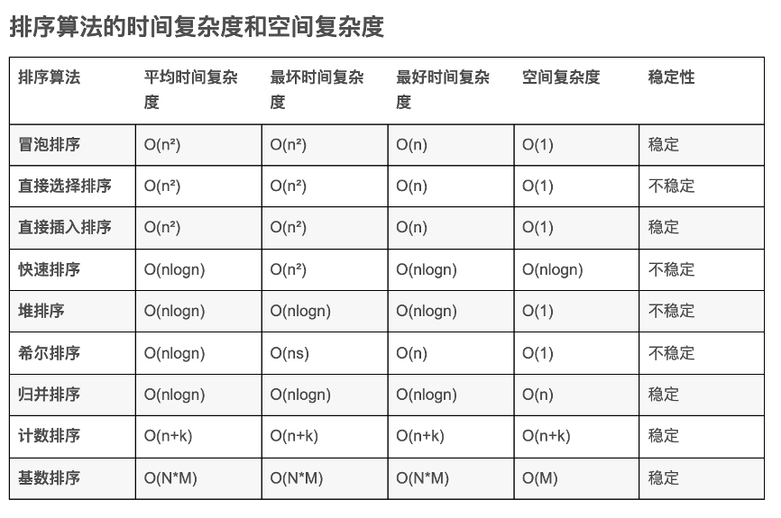

快选希堆 不稳定
基插归冒 稳定

#### 堆排序

##### 堆排序的基本思路 
<font color=red>Amazon summer intern interview, be sure to write the code</font>
（每个内部节点，和左右节点对比，往上浮；之后根分别与最后，倒数第二个交换往下沉）
a.先所有的内部节点的每个，从下到上进行往上浮的操作heap_build
b.然后根节点和最后一个节点交换，然后从根节点向下沉（0,n-1），然后根节点和倒数第二个节点交换，然后往下沉(0,n-2)然后重复上述的过程

也就是先build最大堆，然后逐渐交换，然后重复build

优先队列默认是从大到小进行排序；multiset 基于红黑树实现，默认是从小到大进行排序
priority<int, vector<int>, greater<int> > q;//最小堆
multiset<int, greater<int> > //最大堆

使用归并排序可以求逆序对的数量以及“计算数组的小和”问题: 
特征，如果一个数组中两个元素，nums[i]<nums[j]或者nums[i]>nums[j]再执行某个操作，而且数组元素之间的连续性等没有其他要求，那么使用归并排序计算

```C++
merge函数
while (p1 <= mid && p2 <= right)
    {
        res += arr[p1] <= arr[p2] ? arr[p1]*(right-p2+1) : 0;
        help[i++] = arr[p1] <= arr[p2] ? arr[p1++] : arr[p2++];
    }
    while (p1 <= mid) help[i++] = arr[p1++];
    while (p2 <= right) help[i++] = arr[p2++];
```


##### 堆排序的相关例题：

1.打印N个数组的最大TopK (topk类似题使用堆)

用N个最后的元素建立一个最大堆，然后移去堆顶元素，然后用移去元素的下一个元素放在堆顶调整堆，重复上面的过程；
如果被移去元素数组中没有下一个元素，那么用堆的最后一个元素移到堆顶，让堆的size-1

注意堆排序都是下沉的过程，但是如果向堆中一个一个插入元素，是插入到最后一个位置，heapsize++, 然后上浮过程
同时也可以先全部放入数组中，然后从内部节点倒叙下沉

*****在进行代码编写的时候，可以不直接实现堆，而是用STL的priority_queue（默认最大堆） ******
```C++
struct node
{
    int row;
    int val; //因为是pop_back所以不用记录下标
    node(int _r,int _v)
    {
        row=_r;
        val=_v;
    }
    bool operator<(const node& b)const
    {
        return this->val<b.val;
    }
   
};
priority_queue<node,vector<node>> heap；

因此这道题的解答方案
//首先初始化 n个末尾各自的最大元素入堆
    for(int i=0;i<n;i++)
    {
        if(arr[i].size()==0)
            continue;
        heap.push(node(i,arr[i][arr[i].size()-1]));
        arr[i].pop_back();//最后一个元素入堆
    }
    //开始从末尾遍历
   for(int i=0;i<k;i++)  //从堆中选举k个最大的元素
   {
       cout<<heap.top().val<<" ";//打印出最大的那个元素
       int row=heap.top().row;//那个元素所在行
       heap.pop();
       if(arr[row].size()>0) //最大的那个元素弹出后 用所在行的下一个元素顶上（因为第二大元素一定在已有的元素 + 下一个顶上的元素 中产生）
       {
           heap.push(node(row,arr[row][arr[row].size()-1]));//下一个接替的node
           arr[row].pop_back();
       }
   }
```

PS:类似的一个题：两个有序数组的整体中位数（或者第K位数）
1.使用归并排序，但是只需要记录一个pre cur O(n/2)
2.使用类似二分的删除的方法，先求出中位数的位置k
然后比较两个数组nums1[k/2] nums2[k/2]，较小的那个数组，直接跳过k/2个数 index_next=before_index + k/2


##### 补充知识：
priority_queue的自定义排序函数：
https://www.cnblogs.com/shona/p/12163381.html 记住priority_queue排序大小和排序函数都是和正常反着的
建议使用struct cmp方式，重载operator < 会报错，如果是在solution 类中重载的话

```C++
struct cmp{

    bool operator()(const node &a, const node &b){
        return a.val>b.val; //从小到大排序
    }
};//一定要注意结构体后面添加;
```

2. 查找和最小的K对数字，使用最大堆，以及每个数组最大循环k次

#### 基数排序和桶排序

时间复杂度为O(n)的排序算法：基数排序和桶排序
例题：最大间距问题
桶排序：需要确定桶的数量，然后遍历每一个数，求当前数应该放的桶的位置，有点时候并不一定要明确每个桶里面有哪些数据，只需要知道桶
里面是否有数据（bucket[i]），以及每个桶里面的最大最小值(max_bucket[i], min_bucket[i])，那么就不需要用二维数组记录每个桶里面的具体数据（如例题），然后遍历桶里面的元素，用当前桶的最小值，减去上一个有数据的桶的最大值

##### 基数排序的主要思想：
1.每次排序都是从最低位到最高位进行排序，因此求最大数的位数，作为基数排序循环的次数
2.在每次循环，求当前基数位的count
3.将count进行累加，求在整个count数组中排列的具体位置
4.从大到小重复计算count数组的过程，将data数据排好后放入tmp数组 count[k]--
5.将tmp数组赋值为data数组 基数*10，重复上面的步骤
```C++
int maxbit(int data[], int n) //辅助函数，求数据的最大位数
{
    int maxData = data[0];              ///< 最大数
    /// 先求出最大数，再求其位数，这样有原先依次每个数判断其位数，稍微优化点。
    for (int i = 1; i < n; ++i)
    {
        if (maxData < data[i])
            maxData = data[i];
    }
    int d = 1;
    int p = 10;
    while (maxData >= p)
    {
        //p *= 10; // Maybe overflow
        maxData /= 10;
        ++d;
    }
    return d;
}
void radixsort(int data[], int n) //基数排序
{
    int d = maxbit(data, n);
    int *tmp = new int[n];
    int *count = new int[10]; //计数器
    int i, j, k;
    int radix = 1;
    for(i = 1; i <= d; i++) //进行d次排序
    {
        for(j = 0; j < 10; j++)
            count[j] = 0; //每次分配前清空计数器
        for(j = 0; j < n; j++)
        {
            k = (data[j] / radix) % 10; //统计每个桶中的记录数
            count[k]++;
        }
        for(j = 1; j < 10; j++)
            count[j] = count[j - 1] + count[j]; //将tmp中的位置依次分配给每个桶
        for(j = n - 1; j >= 0; j--) //将所有桶中记录依次收集到tmp中
        {
            k = (data[j] / radix) % 10;
            tmp[count[k] - 1] = data[j];
            count[k]--;
        }
        for(j = 0; j < n; j++) //将临时数组的内容复制到data中
            data[j] = tmp[j];
        radix = radix * 10;
    }
    delete []tmp;
    delete []count;
}
```


##### 乱序数据使用多进程进行排序
每个进程进行各种的快速排序，然后将所有进程排序好的结果进行两两归并
使用pthread_t 和pthread_create
``` C++
 struct node s[10];
    for(int i=0;i<10;i++)
    {
        s[i].id = i;
        s[i].l = i*10;
        s[i].r = i*10+9;
    }
 
    pthread_t t[10];
    for(int i=0;i<10;i++)
        pthread_create(&t[i],NULL,__sort,(void *)&s[i]);
 
    for(int i=0;i<10;i++)
        pthread_join(t[i],NULL);

[完整代码参考链接](https://blog.csdn.net/Return_nellen/article/details/79937320)

```

##### 桶排序例题
<font color=red>存在重复元素 III</font>
使用二分查找（set.lower_bound）和滑动窗口，或者桶排序和滑动窗口，比较经典 
主要思路：查找当窗口元素中是否存在大于等于nums[i]-t的元素，如果存在，判断这个元素是否是小于等于 nums[i]+t 如果存在返回true;
如果是桶排序解决，就设定每个桶的大小为t+1 计算每个nums[i]应该在的桶的编号，判断这个桶是否有数据，如果有数据直接返回true； 如果没有，那么判断左右两边桶的数据之间的abs差是否 <=t，同时在
循环向前的时候记得删除范围大于k的桶里面的数据

感觉使用滑动窗口更好理解，就是查找窗口为k的，是否能够找到当前加入的元素x, [x-t, x+t]范围内的数，而且不是当前的数x,如果能,那么返回true

易错点：
1.滑动窗口记得删除窗口之外的数据
2. nums[i]-t可能超出了整数的范围，一定要记得判断范围


#### 归并排序
归并排序一般是求逆序对个数，或者其他规则的逆序对
比如例题lc493. 翻转对 求i<j, 且nums[i]>2*nums[j]
- 易错点: 有负数+是大于，因此在求解的时候/2 向上还是向下取整会不同
- 题解是将求res这个过程单调拎出来计算，之后再进行归并
```C++
 while(i<=mid){
    while(j<=right&&(long long)nums[i]>(long long)2*nums[j]) j++; //最好不要转为nums[i]/2> nums[j] 因为负数在取整的时候和正数向上和向下不一样
    res+=(j-mid-1);
    i++;
}
```

- 方法二：使用树状数组，但是因为数据的范围太大，因此使用hash对数据进行离散化， 对x 2*x 一些列数据排序后，递增给予他们idx 1....


#### 其他排序例题
1. 寻找两个正序数组的中位数 (寻找两个正序数组的第k个数)

注意k表示的第k个数，而不是下标为k
同时注意算法是一边在进行移动，而不是两边都移动

```C++
//时间复杂度log(m+n) 空间复杂度O(1)
class Solution {
public:
    double getKthElement(vector<int>& nums1, vector<int>& nums2, int k){
        int size1 = nums1.size();
        int size2 = nums2.size();
        int index1 = 0, index2 = 0; 
        while (true)
        {
            if(index1==size1){
                return nums2[index2 + k - 1];
            }
            if(index2==size2){
                return nums1[index1 + k - 1];
            }
            if(k==1){
                return min(nums1[index1], nums2[index2]);
            }
            int newIndex1 = min(index1 + k / 2 - 1, size1 - 1);
            int newIndex2 = min(index2 + k / 2 - 1, size2 - 1);
            int pivot1 = nums1[newIndex1];
            int pivot2 = nums2[newIndex2];
            
            if(pivot1<=pivot2){
                
                k = k - (newIndex1 - index1 + 1);
                index1 = newIndex1 + 1;
            }else{
                
                k = k - (newIndex2 - index2 + 1);
                index2 = newIndex2 + 1;
            }
            cout<<pivot1<<" "<<pivot2<<endl;
            
        }
        
    }
    double findMedianSortedArrays(vector<int>& nums1, vector<int>& nums2) {
        int size1 = nums1.size();
        int size2 = nums2.size();
        int sum = size1 + size2;
        if(sum%2==0){
            return (getKthElement(nums1, nums2, sum / 2) + getKthElement(nums1, nums2, sum / 2 +1)) / 2;
        }else{
            cout<<sum/2+1<<endl;
            return getKthElement(nums1, nums2, sum / 2+1);
        }
    }
};

```

 2. 排序和优先队列结合！！
两个最好的不重叠活动
步骤：
- 先将活动按起始时间从小到大进行排序
- 维护一个最小堆，堆内元素代表活动的结束时间和对应价值(结束时间越早的越先弹出)
- 遍历所有活动，如果堆内的活动结束时间小于当前活动的起始时间，又因为活动时间是从小到大进行排序的，所以当前堆内的活动是可以与后面任意活动一起参与的，因此我们可以维护maxVal记录下当前活动开始前，我们可以选择的最大价值


#### 快速排序
快速排序模板题
```C++
 void quickSort(vector<int>&  nums, int left, int right){
        while(left>=right){
            return;
        }
        int rand_num= rand()%(right-left+1)+left;
        int pivot=nums[rand_num];
        swap(nums[rand_num],nums[left]);
        int l=left;
        int r=right;
        while(l<r){
            while(l<r&&nums[r]>=pivot){
                r--;
            }
            while(l<r&&nums[l]<=pivot){
                l++;
            }
            if(l<r){
                swap(nums[l], nums[r]);
            }

        }
        swap(nums[left], nums[l]);
        quickSort(nums, left, l-1);
        quickSort(nums, l+1, right);
    }
    vector<int> sortArray(vector<int>& nums) {
        int num_len=nums.size();
        quickSort(nums, 0, num_len-1);
        return nums;
    }
```

快速排序找出第k个数的代码模板，类似于二分
```C++
class Solution {
    public int minMoves2(int[] nums) {
        int mid = nums.length / 2;
        int mid_num = quickSort(nums, mid); //这道题中k为mid
        int ret = 0;
        for (int num : nums) {
            ret += Math.abs(mid_num - num);
        }
        return ret;
    }

    public int quickSort(int[] nums, int k) {
        int l = 0;
        int h = nums.length - 1;
        while (l < h) {
            int ret = partion(nums, l, h);
            if (ret == k) {
                break;
            }
            if (ret < k) {
                l = ret + 1;
            } else {
                h = ret - 1; 
            }
        }
        return nums[k];
    }

    public int partion(int[] nums, int l, int h) {
        int p = new Random().nextInt(h - l + 1) + l; //记住pivot是随机产生
        int temp = nums[p];
        nums[p] = nums[l];
        nums[l] = temp;//交换left和pivot的值
        
        //可以如下方式写，也可以，l和r每次交换，最后l和pivot所在的位置交换
        while (l < h) {
            while (l < h && nums[h] >= temp) { //注意等于也要走，因为如果不，就可能导致在中间出现死循环
                h--;
            }
            nums[l] = nums[h];
            while (l < h && nums[l] <= temp) {
                l++;
            }
            nums[h] = nums[l];
        }
        nums[l] = temp;
        return l;
    }
}
```
使用快速排序找到第k个数， 同时考虑结构体(在进行比较的时候使用second, 同时pivot也是second的值)的这种情况， 注意比较value, 但是交换的时候使用index
```C++
    void qsort(vector<pair<int, int>>& v, int start, int end, vector<int>& ret, int k) {
        int picked = rand() % (end - start + 1) + start;
        swap(v[picked], v[start]);

        int pivot = v[start].second;
        int index = start;
        for (int i = start + 1; i <= end; i++) {
            if (v[i].second >= pivot) {
                swap(v[index + 1], v[i]);
                index++;
            }
        }
        swap(v[start], v[index]);

        if (k <= index - start) {
            qsort(v, start, index - 1, ret, k);
        } else {
            for (int i = start; i <= index; i++) {
                ret.push_back(v[i].first);
            }
            if (k > index - start + 1) {
                qsort(v, index + 1, end, ret, k - (index - start + 1));
            }
        }
    }

```

#### 各种排序算法的总结链接：
https://www.runoob.com/w3cnote/ten-sorting-algorithm.html
快速排序的额外空间复杂度是O(logn)， 因为每次递归只使用运用了常数时间的额外空间


1. 常见算法的稳定性（要记住）

不稳定排序算法： 堆排序、快速排序、希尔排序、选择排序 （快选西堆）

稳定排序算法： 基数排序、冒泡排序、插入排序、归并排序 （极差归帽（0））


计数排序的时间复杂度是O(n+k), 空间复杂度为O(k) 
桶排序 O(n+k) 先分桶再快排 O(n+k)//count+tmp数组
基数排序  O(nxk) O(n+k)


2. 比较各种数据结构
数组 插入慢，删除慢，查找慢（通过下标获取快）， 空间连续且固定
链表 插入快，删除快， 查找慢， 物理空间不连续，同时方便扩容
二叉树： 查找、插入、删除都快（如果树保持平衡）。缺点是删除算法复杂。
堆： 堆是一种特殊的完全二叉树
栈：后进先出，存取和查找其他项非常缓慢
队列： 先进先出，存取和查找其他项非常缓慢
散列表（hash）： 则存取极快，插入快。缺点是删除慢，对存储空间使用不充分, 需要解决可能产生的hash冲突。
图：邻接矩阵或者邻接链表，复杂，不同的存储方式导致查找比较缓慢


3. 外部排序方法
外排序的一个例子是外归并排序（External merge sort），它读入一些能放在内存内的数据量，在内存中排序后输出为一个顺串（即是内部数据有序的临时文件），处理完所有的数据后再进行归并。[1][2]比如，要对900 MB的数据进行排序，但机器上只有100 MB的可用内存时，外归并排序按如下方法操作：

    1. 读入100 MB的数据至内存中，用某种常规方式（如快速排序、堆排序、归并排序等方法）在内存中完成排序。
    2. 将排序完成的数据写入磁盘。
    3. 读入每个临时文件（顺串）的前10 MB（ = 100 MB / (9块 + 1)）的数据放入内存中的输入缓冲区，最后的10 MB作为输出缓冲区。（实践中，将输入缓冲适当调小，而适当增大输出缓冲区能获得更好的效果。）
    4. 执行九路归并算法，将结果输出到输出缓冲区。一旦输出缓冲区满，将缓冲区中的数据写出至目标文件，清空缓冲区。一旦9个输入缓冲区中的一个变空，就从这个缓冲区关联的文件，读入下一个10M数据，除非这个文件已读完。这是“外归并排序”能在主存外完成排序的关键步骤 -- 因为“归并算法”(merge algorithm)对每一个大块只是顺序地做一轮访问(进行归并)，每个大块不用完全载入主存。

为了增加每一个有序的临时文件的长度，可以采用置换选择排序（Replacement selection sorting）。它可以产生大于内存大小的顺串。具体方法是在内存中使用一个最小堆进行排序，设该最小堆的大小为{\displaystyle M}M。算法描述如下：

    1. 初始时将输入文件读入内存，建立最小堆。
    2. 将堆顶元素输出至输出缓冲区。然后读入下一个记录：
        a. 若该元素的关键码值不小于刚输出的关键码值，将其作为堆顶元素并调整堆，使之满足堆的性质；
        b. 否则将新元素放入堆底位置，将堆的大小减1。
    3. 重复第2步，直至堆大小变为0。
    此时一个顺串已经产生。将堆中的所有元素建堆，开始生成下一个顺串。[3]
    此方法能生成平均长度为{\displaystyle 2M}2M的顺串，可以进一步减少访问外部存储器的次数，节约时间，提高算法效率。

总结：顺串产生可以用1）小顶堆或者2）划分为多个小文件+各自快速排序产生


4. 向数组中追加 K 个整数（lc6017）
题意，向数组中插入k个数组都没出现过的正整数，如果是插入的和最小
解决方案：排序数组，然后填充数组的空隙， 使用高斯求和公式得到结果会更快
易错点：注意的是需要在数组前面和后面加两个哨兵


5.lc1539. 第 k 个缺失的正整数 (easy)
- 一个排序正整数数组，找到缺失的第k个正整数
- 算法1：为了减少分类讨论，直接在数组前面+一个哨兵节点0， 然后k依次减去相邻两个数中间包含数的个数
- 算法2：缺失的正整数一定 >= k；数组中每出现一个 <= k 的数字, 意味着少了一个缺失的数字, 此时k+1
```C++
for (int i = 0; i < arr.size(); i++) {
    if (arr[i] <= k) {
        k++;
    }
}
return k;
```

6. lc414. 第三大的数（easy）
- 题意：返回第k大的数，相同的数同一level, 如果每个第k大的数，返回第一大
- 注意数据中可能包含INT_MIN
- 思路：可以使用排序，可以O(n)， 用三个数a, b, c, 初始化为long INT_MIN
- 定要注意等于的情况是不更新的，比如等于b, 不会更新c的！！！！


7. lc870. 优势洗牌
- 题意：将nums1和nums2如何进行配对，使得在i, nums1[i]>nums2[i]的对数最大
- 田忌赛马的思想
- 使用优先队列，将每个nums2的下标和数据入队
- 每次弹出nums2的最大的一个，如果当前nums1的最大不能打败当前的数，那么就将nums1的最小和nums2的最大匹配（nums1 index left++）, 否则right-- （更易理解）
- 或者每次弹出nums2的最小的一个，如果当前nums1的最小不能打败当前的数，那么就将nums1的最小和nums2的最大匹配(此时用优先队列好像不行，可以直接对结构体nums2进行排序), 否则right--
- “滑动窗口的最大值”，也是使用了优先队列

8. 奇偶稳定排序
- 将数组的奇数全部排在偶数前面，同时不交换奇数和偶数原本的相对顺序
- 用一个k来记录前面以及排好序的奇数的个数， 然后每遇到一个奇数，就使用冒泡排序的方法，一个一个的交换到前面去
```python
def reOrderArray(arr):
    m = len(arr)
    k = 0 # 记录当前已经排序好的奇数个数
    for i in range(m):
        if arr[i] % 2 == 1:
            j = i
            while j > k:  # 将奇数移到最前面
                temp = arr[j]
                arr[j] = arr[j-1]
                arr[j-1] = temp
                j -= 1
            k += 1 
    print(arr)
if __name__ == '__main__':
    arr = [1,2,5,4,7,6,12]
    reOrderArray(arr)
```

9.lc703. 数据流中的第 K 大元素
标准优先队列的题目
- 注意k大和k小的含义区别
- 易错点，最开始的nums为空；因此需要判断优先队列里面元素>k的时候才弹出，否则可能会出现空队列弹出，或者push 空的错误


10.6155. 找出数组的第 K 大和
<font color=red>不重不漏的生成一个全正数序列的所有子序列和的方法</font>
1. 使用小根堆维护(sum, i)
2. 选择将a_{i+1} 元素添加到弹出的头元素(sum+a_{i+1}， i+1) 
3. 选择将a_{i+1} 元素添加到弹出的头元素同时删除第i个元素(sum+a_{i+1}-a_{i}， i+1) 

- 变形1：求第 k个最大的子序列和，与求第 k的最小的子序列和是一样的。我们求出 k小子序列后取反, 也就是所有元素之和减去 k 小 子序列和，就能得到 k大子序列和。
- 变形2，序列中有负数。将所有负数转为正数后求k大子序列，然后减去**所有的**负数元素
- 变形2的第二种解法是，先所有的正数相加一定是最大的数，然后从小到大的减去sum需要减去的子序列，知道第k次，就是第k大的和


#### 总结
ok

主要是针对大文件或者多线程情况的下排序，或者数据结构本身的考察

priority_queue和set multiset都是有序的集合，但是priority_queue不支持从里面删除一个元素，set和multiset支持
s.erase(s.find(val)), 如果一定要用priority_queue，可以考虑使用延迟删除，就是先判断元素的有效性，再返回结果


okk


