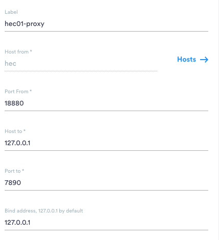

#### 1.让远程服务器节点使用本地节点的vpn进行翻墙， 适用于远程节点

方法一：
假设，服务器上你选择使用端口18860，先在你的mac上运行命令：ssh -C  -N -g -R 18860:127.0.0.1:7890 服务器用户名@服务器ip  然后在服务器运行：export https_proxy=http://127.0.0.1:18860 那么当服务器使用Https去下载东西的时候，就会通过端口18860把下载请求转发到你mac的7890端口，然后你的Mac作为一个代理进行下载，服务器就能获取目的网址的内容了。当你下载完的时候，记得unset https_proxy
``` bash
ssh -C  -N -g -R 18861:127.0.0.1:7890 zhinengjisuan@10.5.30.42 -o ProxyCommand="ssh shu@10.5.26.19 -W %h:%p"
shu@10.5.26.19's password: 
```

curl https://www.baidu.com 反正数据说明连接正确

方法二: 使用terminus节点，建立一个新的连接，配置如下

这个节点相当于加了方法一的命令 ```ssh -C  -N -g -R 18860:127.0.0.1:7890 服务器用户名@服务器ip```

然后运行一下proxy脚本,相当于方法一的第二条命令，具体的脚本内容如下:意思是bash一停（exit）, 这两条命令的效用就停止了
```bash
#!/bin/bash
export http_proxy=http://127.0.0.1:18880
export https_proxy=https://127.0.0.1:18880
bash
```

PS: 18860是随机选的端口， 7890的clashx的代理端口
只能使用curl, 不能使用ping 因为ping是在TCP协议之上的，但是curl是http协议（具体见操作系统）


#### 2. 查看端口号被哪个进程占用
```bash
sudo lsof -i :7891
```
查看某个进程， 例子为dlv
```bash
ps -ef | grep dlv
```


3. conda安装torch 1.8.0版本

```conda install pytorch==1.8.0 torchvision==0.9.0 torchaudio==0.8.0 cudatoolkit=10.2 -c pytorch```

pip install torch==1.8.0+cu101 torchvision==0.9.0+cu101 torchaudio==0.8.0 -f https://download.pytorch.org/whl/torch_stable.html

//1.8.0 如果运行起来还是非常慢的话，修改为1.7 因为1.8.1稳定版本需要gpu驱动大于hec01 440.33
pip install torch==1.7.1+cu101 torchvision==0.8.2+cu101 torchaudio==0.7.2 -f https://download.pytorch.org/whl/torch_stable.html -i https://pypi.douban.com/simple some-package

4. 查看并杀死vscode 进程 macos
```pgrep -f "vscode" | xargs kill``` 或者 ```pgrep -f "vscode"``` 查看进程号之后使用 ```kill -9 pid```


#### 本地通过浏览器+跳板机访问远程服务器上的应用  grafana/
ssh -L 30091:127.0.0.1:30090 shu@10.5.26.66 -o ProxyCommand="ssh shu@10.5.26.19 -W %h:%p"
将远程服务器的30090端口映射到本地的30091端口，然后可以在本地浏览器中输入
http://localhost:30090/graph 访问远程服务器的登录界面

#### 使用跳板机在服务器间传输文件scp:
scp -o 'ProxyJump shu@10.5.26.19'  -r /Users/hushuang/Desktop/Graduate_Thesis wanghongsheng@10.5.30.43:/home/wanghongsheng/shu


#### linux mv命令 将当前文件夹除了xx的文件夹move到另外一个文件夹
mv !(github.com|gopkg.in|golang.org|k8s.io) github.com/

注意：
mv /!(github.com|gopkg.in|golang.org|k8s.io) github.com/ 是错误的！！！！！

如果出现bash: !: event not found，那么运行下面命令解决
shopt -s extglob

#### latex中插入代码
https://blog.csdn.net/u012675539/article/details/49131567

