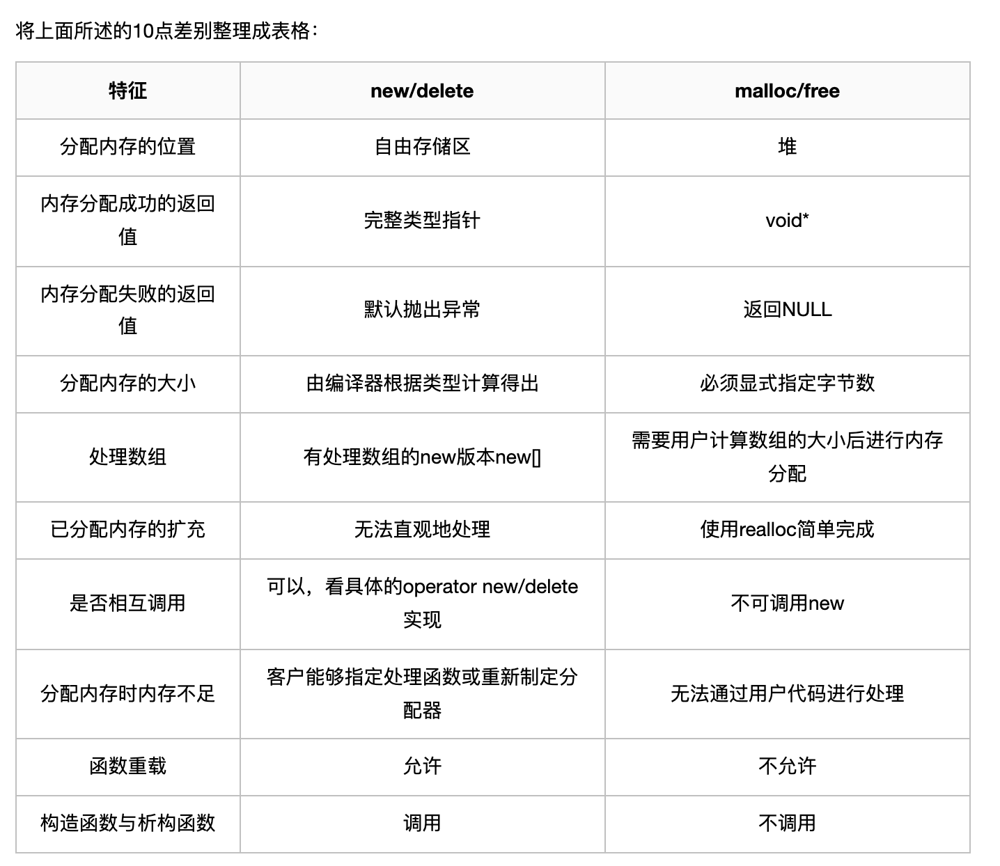

#### python

https://www.i4k.xyz/article/qq_38992249/119968248 总结了python八股

1. python GIL介绍

2. list tuple set的区别

3. python迭代器和生成器的区别是什么
生成器本质上还是一个迭代器，也是用在迭代操作中，因此它有和迭代器一样的特性，唯一的区别在于实现方式上不一样，后者更加简洁；
生成器只是在需要这个值再生成

4. 迭代器
迭代器对象要求支持迭代器协议的对象。在Python中，支持迭代器协议就是实现对象的__iter__()和next()方法。
其中__iter__()方法返回迭代器对象本身；next()方法返回容器的下一个元素，在结尾时引发StopIteration异常。
iter是可迭代对象，可迭代对象才能调用next函数

5. 生成器
生成器(generator)就是一个函数，它提供了一种实现迭代器协议的便捷方式。
生成器与普通函数的区别在于它包含 yield 表达式，并且不需要定义 __iter__()和__next__()。

####  C++

##### 1.vector
find(vector.begin(), vector.end(), target_val)!=vector.end() find函数返回的是一个迭代器

vector.push_back(i)
vector.pop_back()

vec1.swap(vec2)//进行vector1和vector2的交换
vec2(vec1.begin(), vec1.begin()+4)表示截取vector的一部分，并赋值给vec2,注意后面的值表示vec不需要 也就是左闭右开模式

vector最后一个元素，vector.back()

vector.insert(vec.begin()+pos, target); // 将target元素插入到pos位置

auto pos=lower_bound(nums.begin(), nums.end(), target)
index = pos-nums.begin() //
lower_bound返回的是大于等于目标函数的数， upper_bound返回的是大于目标函数的数

注意和set的lower_bound不一样的 
set.lower_bound(targets) 返回一个迭代器

mp的lower_bound也是不一样的
auto iter = mp.lower_bound(val)

set和map中的元素都是排好序的

##### 2.unordered_set my_set
my_set.find(target_value)!=my_set.end() or my_set.count(target_value)!=0
my_set.insert(value)
my_set.erase(value)A

unordered_set查找元素的两种方式：（1）umap.find(target)!=-1  (2) umap[target]
unordered_set在进行查找的时候可以直接使用unordered_set[target]即使是target不存在也不会报错，
但是在vector中查找某一个元素就需要vec.find(target)!=vec.end() 

##### 3. priority_queue / queue
q.push()
q.pop()

##### 4. set insert(value) erase(value) push pop
遍历 for(auto iter=set.begin(); iter!=set.end(); iter++)

用vector里面的元素初始化set unordered_set<int> nums_set(nums1.begin(), nums1.end());//其中nums1是vector

##### 5.map
插入元素：map[key]=value; 或者map.insert(make_pair(key, value))
删除元素：map.erase(key)//注意不是remove

查找元素：map.find(key)

复制：hash.insert(hash1.begin(), hash1.end())
PS： vector的复制是 vec.assign(vec1.begin(), vec1.end())

##### 6.其他语法
判断字符是字母：isalpha()

判断字符是数字：isdigit()

判断字符是字母或数字：isalnum()

同时注意c++中，字符用单引号表示，字符串用双引号表示

注意c++中只有数组能够使用memset，在vector中不能使用

##### 7.string 
find函数 pos=s.find(target)  pos=s.find(target,0)
如果没有找到返回s.npos 或者string::npos

原地移除数组上的元素，我们说到了数组上的元素，不能真正的删除，只能覆盖。array.erase(i)的时间复杂度是O(n)

##### 8.set 数组 map的选择
主要是看数据的范围，如果数据返回不确定那么尽量选择map or set，如果确定是小写字母的话，也就是26个字母，可以使用数组
set包含 unordered_set（无序， 哈希表，不能重复， 查询和增删效率O(1)）, multiset（有序，红黑树，可以重复 O(nlogn)）, set(有序， 红黑树，不能重复， O(nlong))； map类似
三种都是只能erase和insert不能修改数值， map不能修改key但是可以修改value

##### 9. stack
栈的底层实现可以是vector, dequeue, list
栈只能获取最后一个元素，无法直接获取第一个元素
top()	返回栈顶元素的引用，类型为 T&，如果栈为空，返回值未定义 
pop()	栈顶元素出栈
size()	返回栈中元素的个数
empty()	栈中没有元素时返回 true
emplace()	使用传入的参数调用构造函数，在栈顶生成对象
push(const T& obj)	将对象副本压入栈顶，通过调用底层容器的 push_back() 函数实现
push(T&& obj)	以移动对象的方式将对象压入栈，通过调用底层容器的有右值引用参数的 push_back() 函数实现
swap(stack<T> & other_stack)	将当前栈中的元素和参数中的元素交换，参数所包含元素的类型必须和当前栈的相同，对于 stack 对象有一个特例化的全局函数 swap() 可以使用

可以出一道面试题：栈里面的元素在内存中是连续分布的么？

这个问题有两个陷阱：
陷阱1：栈是容器适配器，底层容器使用不同的容器，导致栈内数据在内存中是不是连续分布。
陷阱2：缺省情况下，默认底层容器是deque，那么deque的在内存中的数据分布是什么样的呢？答案是：不连续的，下文也会提到deque。

##### 10.queue 队列
可以访问队列最后一个元素，但是无法pop最后一个元素
queue入队，如例：q.push(x); 将x 接到队列的末端。

queue出队，如例：q.pop(); 弹出队列的第一个元素，注意，并不会返回被弹出元素的值。

访问queue队首元素，如例：q.front()，即最早被压入队列的元素。

访问queue队尾元素，如例：q.back()，即最后被压入队列的元素。

判断queue队列空，如例：q.empty()，当队列空时，返回true。

##### pair

pair<int, int> 访问元素不是用下标而是用first second; 创建一个pair用pair<int, int> res = make_pair<a, b>
或者用括号 pair<int, int> b(1, 2);

##### multiset/set
两者都是存储的重复的数据，不一样的是前者可以存储冗余的数据
删除一个数
c1.erase(c1.find(x))//删除一个x
c1.erase(x)//删除所有x元素

##### 新建一个未知长度的数组
int *queue;
queue=new int[k+1] 主要是用于类构建动态数组的这种情况

#### 向上取整
(x+(b-1))/b*b

#### malloc和new的区别

#### hashMap原理

#### C++模板的使用方法
[参考链接](https://blog.csdn.net/qq_35637562/article/details/55194097)
struct的class的区别：
class继承的权限默认是private, struct继承的权限是public
class可以作为模板的参数，但是struct不行
class不能使用{}进行初始化，struct在没有虚函数的时候可以使用{}进行初始化

